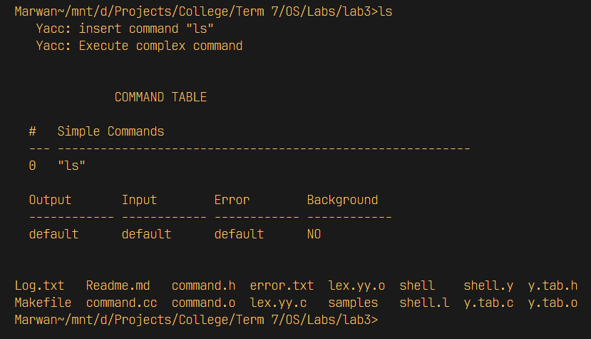

# Mini Shell Using Lex & Yacc :shell:

> "it's the purest form of computing you'll ever find." - Walter White 🧪

## Getting Started 📖

* A mini shell program using lex and yacc is a simple implementation of a shell, which is a
command-line interface for interacting with an operating system. The program is developed
using two tools: lex and yacc.

* Lex is used to define the lexical structure of the shell, such as the keywords, operators, and
special symbols used in the shell. It converts these elements into tokens that can be processed
by yacc.

* Yacc, on the other hand, is used to define the grammar and syntax of the shell. It takes the
tokens generated by lex and uses them to build the structure of the shell commands. It also
implements the necessary actions to execute the commands, such as calling system functions
or running external programs.

* The combination of lex and yacc provides a simple yet powerful way to develop a shell
program, making it an ideal tool for learning about shell programming and the basics of
parsing.

## Features 🚀

* Searching using "grep" command 🔎 
* Navigation using "cd" command 🚢
* Listing files with "ls" command 🖊️
* Piping allowing commands to be input to another command 🚪
* Displaying contents of files using "cat" command 🐱
* Redirection using ">,<" as arugments 🔀
* basically all shell commands 💯

**and many more go ahead and expriment as you like** 


## Sample Case 🔬

<p align=center width=100%>

</p>

## Table of contents :label:

| File Name | Description                                                                                      |
|-----------|--------------------------------------------------------------------------------------------------|
| [command.cc](https://github.com/XMaroRadoX/Mini-Shell-Project-Using-Lex-and-Yacc/blob/master/command.cc)   | Contians the implementation of Commands used by the shell
| [command.h](https://github.com/XMaroRadoX/Mini-Shell-Project-Using-Lex-and-Yacc/blob/master/command.h)   | Contians the Structure of the command used by the shell|
| [shell.l](https://github.com/XMaroRadoX/Mini-Shell-Project-Using-Lex-and-Yacc/blob/master/shell.l)   | Contians the implementation of producer code using OOP principles|
| [shell.y](https://github.com/XMaroRadoX/Mini-Shell-Project-Using-Lex-and-Yacc/blob/master/shell.y)| contains run tests used by Makefile|
| [Makefile](https://github.com/XMaroRadoX/Mini-Shell-Project-Using-Lex-and-Yacc/blob/master/Makefile)  | Used to compose the shell using c++ and alert the user that it is ready                                                                          |
| [error.txt & log.txt](https://github.com/XMaroRadoX/Mini-Shell-Project-Using-Lex-and-Yacc/blob/master/log.txt)| contains log info during the execution of the shell program

### Pre-requisites :screwdriver:

* Linux : Ubuntu or any debian based distro
* C Compiler
* make
* bison and flex

#### Install pre-requisites :toolbox:

Have to be on debian-based distro that have apt as it's package manager to run these commands

```sh
sudo apt update && sudo apt install gcc make bison flex

```

### Run :green_circle:

* Navigate to directory
* Run Make

`make`

### Licensing :pencil:

This code is licensed under the MIT License.

### Authors :pen:

* Marwan Radwan

### Contribution :clinking_glasses:

Feel free to contribute just make a pull request and do what you wish. 😼

[](https://opensource.org/licenses/MIT)
